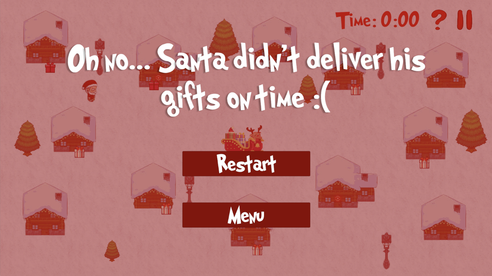

# Sleigh, Santa!
Last Updated: Nov 27, 2023

# Ho Ho Ho!
It's Christmas, and Santa has gifts to deliver! Unfortunately, he's a huge procrastinator, and now he's on a time crunch – he has just a few minutes left to get the last gifts to these houses. However, the grouchy grinch is trying to seize this last opporunity to spoil Christmas, and keeps stealing the gifts Santa puts down. Scare him away if you can, and deliver all the gifts to save Christmas!

Sleigh, Santa! is a 2D game I created as a final project for my COMP_SCI 376-0 Game Design class in about two weeks. The player plays Santa, and tries to deliver all the gifts within a set timeframe.

While this project is a culmination of the things I have learned this quarter, I still enjoyed learning and incorporating new features into the game. I made a more interactive instructions menu and added motion based animation. Additionally, this is my first time-based game, and I thought it was interesting to explore how that affects game mechanics.

# Design
When first designing the game, I knew I wanted a retro pixel-vibe, similar to Stardew Valley. This informed a lot of my design and game choices, and I'm happy that the final product ultimately ended up pretty similar to my vision. More details on the design can be found in the DEVLOG.pdf file.

## Aesthetic Goals
- The player is motivated to deliver all the gifts, and feels a sense of achievement when all the gifts are delivered.
    - Success: The player is satisfied when they manage to deliver all the gifts.
    - Failure: The player is not motivated to deliver the gifts.
- The player experiences tension and urgency when the grinch threatens to steal the gifts.
    - Success: The player feels tension when the grinch appears, and is motivated to scare it away.
    - Failure: The player does not find the grinch exciting or care whether the grinch steals the gifts.

## Core Loop
1. Pick up gift at sleigh.
2. Move towards house.
3. Place gift at house.
4. Scare away grinch if grinch exists.

# Gameplay
This game is intended to be played with a keyboard. There are additional instructions in the INSTRUCTIONS.pdf file.
- Use the arrow keys or WASD keys to move.
- Press SPACE to pick up or place a gift.
    - Gifts can only be picked up near the sleigh, and can only be placed in front of houses.
- Place gifts at all the houses within the timeframe to win.
- The grinch will randomly appear at houses with gifts. He will stay there for a few seconds, then disappear with the gift. However, if you can get close enough to the grinch before he disappears, you can scare him off.
- If you do not place all the gifts at the houses in time, you lose.

# Build
A build for this game is available under releases.

Download and unzip the "Sleigh, Santa!" file. Open the application to run the game.

Alternatively, you can open the project in the Unity Editor. It uses Unity 2022.3.10f1.

Open and run the "MainMenu" scene to start the game.

# Images
   
*Main Menu*

   
   
   
*Instructions*

   
   
*Gameplay*

   
   
*Win/Loss Screens*

# Credits
Santa Sprite:
http://tkool.kagati.com/en/archives/1769   
Grinch Sprite:
https://www.spriters-resource.com/ds_dsi/grinchstolechristmas/sheet/32690/   
Snow Background:
https://forum.profantasy.com/discussion/1578/snow   
Sleigh sprite:
https://www.vecteezy.com/png/15312075-christmas-sleigh-with-gifts-and-deer-in-pixel-art-style-santa-s-new-year-s-reindeer-cart   
Red gift:
https://pngtree.com/so/pixel-gift-vector   
White gift:
https://www.redbubble.com/i/sticker/Pixel-Present-by-chipdesigns/132524817.EJUG5   
UI Buttons:
https://www.freepik.com/premium-vector/start-play-pause-button-doodle-sketch-style-question-exclamation-arrow-mark-symbol_34160493.htm   
Font:
https://www.1001fonts.com/grinched-font.html   
Background Music:
https://www.fesliyanstudios.com/royalty-free-music/downloads-c/christmas-music/33  
Evil laugh SFX:
https://samplefocus.com/samples/evil-laugh   
Place gift SFX:
https://mixkit.co/free-sound-effects/win/   
Shocked grinch SFX:
https://pixabay.com/sound-effects/search/shocked/